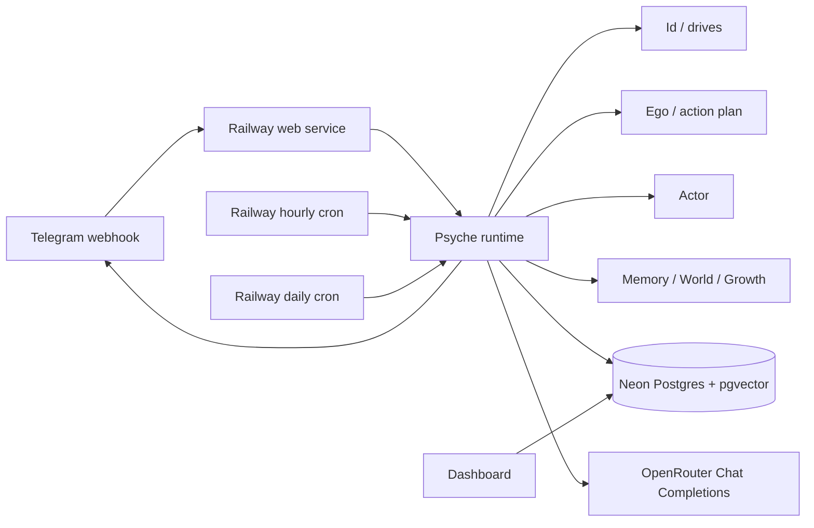

# Mira

Mira 是一个运行在 Railway 上的 Telegram-native AI companion 原型。它不是把 ChatGPT 套进 Telegram，而是用一个可观察的 Psyche Engine 管理人格状态、选择性记忆、主动行为、内在世界和缓慢成长。

当前实现以“能部署、能解释、能继续扩展”为目标：复杂决策使用启发式和 OpenRouter JSON 输出，外部调用失败时有确定性 fallback。

## Architecture



主要目录：

- `app/`：Next.js App Router 页面、Dashboard 和 Route Handlers。
- `core/`：消息 runtime、prompt 组装、指标和事件日志。
- `psyche/`：Analyzer、Id、Ego、Actor、Memory、World、Growth、Novelty。
- `db/`：Drizzle schema、Neon client 和 repository。
- `telegram/`：Webhook 解析、鉴权和 Bot API client。
- `tools/`：只允许调用 registry 中登记的工具；当前只有 mock photo。
- `scripts/`：数据库、seed、webhook 和 Railway Cron 入口。
- `drizzle/`：可审查的增量 SQL migrations。

## Requirements

- Bun 1.3+
- Node.js 20.9+（Next.js / Railway runtime）
- Neon Postgres，并启用 pgvector
- Telegram Bot token
- OpenRouter API key
- Railway project

## Environment variables

本地复制 `.env.example` 为 `.env`。Railway Web、hourly cron、daily cron 三个服务需要引用同一组变量。

| Variable | Required | Purpose |
| --- | --- | --- |
| `TELEGRAM_BOT_TOKEN` | yes | Telegram Bot API |
| `TELEGRAM_ALLOWED_USER_ID` | yes | 唯一允许使用 bot 的 Telegram user id |
| `TELEGRAM_WEBHOOK_SECRET` | yes | 校验 `X-Telegram-Bot-Api-Secret-Token` |
| `BASE_URL` | no | 默认 `https://openrouter.ai/api/v1`，只在服务端使用 |
| `API_KEY` | yes | OpenRouter API key |
| `MODEL` | no | 默认 `openai/gpt-4.1-mini` |
| `DATABASE_URL` | yes | Neon pooled Postgres URL |
| `CRON_SECRET` | yes | 保护 HTTP cron routes |
| `ADMIN_PASSWORD` | yes | Dashboard 登录密码 |

建议生成随机 secret：

```bash
openssl rand -hex 32
```

不要把 `API_KEY`、Bot token、数据库 URL 或密码写入客户端变量，也不要使用 `NEXT_PUBLIC_` 前缀。

## Local development

```bash
bun install --frozen-lockfile
bun run db:migrate
bun run seed
bun run dev
```

打开 [http://localhost:3000](http://localhost:3000)。Dashboard 入口是 `/login`，登录后访问 `/dashboard`。

提交前检查：

```bash
bun run test
bun run typecheck
bun run build
bunx drizzle-kit check
```

## Neon Postgres and pgvector

1. 在 Neon 创建 project/database。
2. 把 pooled connection string 写入 `DATABASE_URL`。
3. 运行 migration 和 seed：

```bash
bun run db:migrate
bun run seed
```

`0000_init.sql` 会执行 `CREATE EXTENSION IF NOT EXISTS vector`。已有数据库升级使用增量 migration，不要重写已经执行过的 migration。

开发期如果要让 schema 直接对齐数据库，也可以运行：

```bash
bun run db:push
bun run db:studio
```

`db:push` 适合本地快速迭代；生产环境优先使用可审查的 `db:migrate`。

当前数据库 client 使用 `@neondatabase/serverless` 的 Neon HTTP driver。如果以后改用普通 Railway Postgres，需要同时更换 driver，并确认数据库安装了 pgvector；不能只替换 `DATABASE_URL`。

## Create the Telegram bot

1. 在 Telegram 找 `@BotFather`。
2. 执行 `/newbot` 并保存 token。
3. 给 bot 发一条私聊消息。
4. 通过 Bot API `getUpdates` 或可信工具取得自己的数字 user id，写入 `TELEGRAM_ALLOWED_USER_ID`。

Mira 只接受私聊。群聊会被忽略，避免 Telegram 的 `message_id` 在不同 chat 中碰撞。

## Deploy the Web service to Railway

仓库根目录的 `railway.json` 只固定共享的 Railpack builder。Web 和两个 Cron 使用不同的 Railway service settings，避免同仓库配置覆盖各自的启动命令。

```bash
railway login
railway link
railway up --detach --message "Deploy Mira web runtime"
railway domain
```

首次部署后，把 Railway domain 写入 `BASE_URL` **是不对的**：`BASE_URL` 是 OpenRouter API 地址。Telegram webhook URL 应单独传给设置脚本。

在 Railway 为 Web 服务配置全部环境变量，然后执行生产 migration/seed：

```bash
railway run bun run db:migrate
railway run bun run seed
```

健康检查：

```bash
curl -fsS https://YOUR_DOMAIN/api/health
```

返回 `configured: false` 表示进程已启动，但运行密钥尚未配置；它不代表数据库 migration 已完成。

## Set the Telegram webhook

```bash
bun run telegram:set-webhook -- https://YOUR_DOMAIN
```

脚本会注册：

```text
https://YOUR_DOMAIN/api/telegram/webhook
```

Webhook route 会同时校验 Telegram secret token、允许的 user id 和 private chat。查看 Telegram 投递状态：

```bash
curl "https://api.telegram.org/bot$TELEGRAM_BOT_TOKEN/getWebhookInfo"
```

不要把真实 token 放进工单、截图或 shell history。

## Railway Cron

Railway Cron 启动一个短进程，任务完成后必须退出。因此 cron 服务直接运行 runtime，不启动 Next.js Web server。

同一仓库创建两个独立 Railway service，并设置各自的 start command 和 UTC schedule：

| Service | Schedule (UTC) | Start command |
| --- | --- | --- |
| `mira-hourly` | `0 * * * *` | `bun run cron:hourly` |
| `mira-daily` | `50 14 * * *` | `bun run cron:daily` |

`50 14 * * *` 对应 Asia/Tokyo 23:50。两个 cron service 必须引用和 Web 相同的 Neon、OpenRouter、Telegram 配置。它们不需要 public domain 或 healthcheck。

HTTP routes 仍保留给手动验证或外部调度器，并且必须校验 `CRON_SECRET`：

```bash
curl -fsS -H "Authorization: Bearer $CRON_SECRET" \
  https://YOUR_DOMAIN/api/cron/hourly

curl -fsS -H "Authorization: Bearer $CRON_SECRET" \
  https://YOUR_DOMAIN/api/cron/daily
```

这些调用可能真的发送 Telegram 消息或写 daily journal，不要在生产环境反复执行。

## Dashboard

Dashboard 使用 `ADMIN_PASSWORD` 登录，并把登录状态放在 httpOnly cookie 中。页面包括：

- Overview：今日消息、主动预算、工具、记忆、mood、active arcs、近期事件。
- Conversations：消息、annotation、topics、importance、novelty、raw JSON。
- State：traits、mood、drives、relationship、7 天图表和状态变化。
- Psyche：Id 驱动、Ego action plan、Actor 配置、cooldown。
- Memory / World：记忆、seed cards、world events 和手动维护入口。
- Events / Proactive / Tools：完整运行日志和主动性原因。
- Audit：人格变化、记忆写入、工具调用和 daily reflection 的证据。
- Settings：角色、policy、quiet hours、模型、边界和 seed cards。

数据库不可用时 Dashboard 会明确显示 demo snapshot，不会把 demo 数据标成实时数据。

## Test the runtime

Telegram：

1. 确认 `getWebhookInfo` 中 URL 和最近错误为空。
2. 使用允许的账号给 bot 发私聊消息。
3. 检查 Dashboard Conversations 和 Events。
4. 确认出现 `user.message`、`psyche.analyzer`、`psyche.ego.plan`、`assistant.message`。

Hourly proactive：

```bash
bun run cron:hourly
```

它可能因为 quiet hours、每日预算、最短间隔或分数不足而选择不发送；这也是正常且可审计的结果。

Daily reflection：

```bash
bun run cron:daily
```

同一 companion/date 只会写入一次 journal。traits 的单日变化在 Growth Engine 中硬限制为每项不超过 `0.01`。

## API routes

- `POST /api/telegram/webhook`
- `GET /api/cron/hourly`
- `GET /api/cron/daily`
- `POST /api/admin/login`
- `GET /api/admin/state`
- `GET /api/admin/messages`
- `GET|POST|DELETE /api/admin/memories`
- `GET /api/admin/events`
- `GET|POST /api/admin/settings`
- `POST /api/admin/seed`
- `POST /api/admin/world/generate`
- `GET /api/health`

## Design Notes

- **OpenRouter only**：当前只实现 OpenAI-compatible Chat Completions，不做 provider abstraction。
- **没有二次审查模块**：Actor 直接输出；危机表达使用确定性 safety override，工具名由 registry allowlist 约束，角色边界进入 Actor prompt。
- **选择性记忆**：importance threshold、use count 和 cooldown 防止所有内容都被保存或重复消费。
- **跨服务状态一致性**：Web 与 Cron 使用数据库 compare-and-swap 和重试，避免整块状态互相覆盖。
- **主动预算先占用**：发送前创建 reservation，失败时释放；发送成功但后续持久化失败时保留占用，避免下一次 cron 连续打扰。
- **Telegram 是至少一次投递**：Telegram webhook 会重试。当前 processing lease 和幂等记录能覆盖常见重复请求，但“Telegram 已发送、assistant 数据库写入失败”仍可能产生重复回复。严格 exactly-once 需要数据库 outbox/queue，是后续升级项。
- **同步消息链路**：一次 webhook 内完成最多三次 20 秒 LLM 调用。流量或延迟上升后，应把处理改成 durable queue/outbox。
- **mock photo 明示为生成内容**：不会声称真实拍照、旅行或现实存在。
- **Health 是进程健康，不是数据库验收**：部署后仍必须单独运行 migration、seed 和真实 Telegram smoke test。

## Next steps

- 数据库 outbox 和异步 webhook worker。
- Embedding 写入、pgvector 相似度检索和 memory consolidation。
- 更细的 safety policy 与可测试的边界规则。
- 真实图片 provider，但保持同一个 tool registry contract。
- 多用户隔离、正式身份系统、rate limit 和 observability。
- Railway preview environment 与 migration gate。
