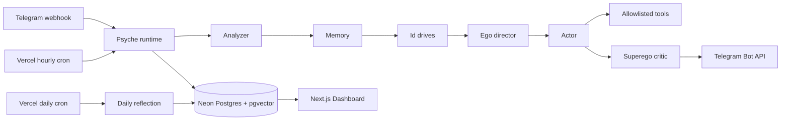

# Mira

Mira 是一个部署在 Vercel 上的 Telegram-native AI companion runtime。当前 companion 叫 **Mira**。它把对话、选择性记忆、内在世界、主动行为、人格慢变化和审查记录放进同一个可观测运行时，而不是把 Telegram 只当作 ChatGPT 的输入框。

这是一个可运行的 MVP：复杂决策使用可替换的启发式和 OpenRouter Chat Completions JSON 输出；所有关键决策都会写入 Neon Postgres，Dashboard 可以追踪原因和结果。

## 架构



主要目录：

- `app/api/telegram`：Telegram webhook 入口。
- `app/api/cron`：每小时主动行为和每日反思。
- `app/api/admin`：受管理员 cookie 保护的 Dashboard API。
- `psyche`：Analyzer、Id、Ego、Actor、Critic、Memory、World、Growth 和 Novelty 模块。
- `core`：流程编排、共享类型、指标和 prompt 组装。
- `db`：Drizzle schema、Neon client 和数据仓库。
- `app/dashboard`、`components/dashboard`：人格运行时观测台。

## 本地运行

要求 Node.js 20.9+，推荐 Node.js 22。

```bash
npm install
cp .env.example .env
npm run db:push
npm run seed
npm run dev
```

打开 `http://localhost:3000/login`，使用 `ADMIN_PASSWORD` 登录。

生产前检查：

```bash
npm test
npm run typecheck
npm run build
```

## 环境变量

```dotenv
# OpenRouter。BASE_URL 是 LLM API 地址，不是站点地址。
BASE_URL=https://openrouter.ai/api/v1
API_KEY=your_openrouter_key
MODEL=openai/gpt-4.1-mini

DATABASE_URL=postgresql://...
TELEGRAM_BOT_TOKEN=...
TELEGRAM_ALLOWED_USER_ID=123456789
TELEGRAM_WEBHOOK_SECRET=a-long-random-secret
CRON_SECRET=another-long-random-secret
ADMIN_PASSWORD=a-strong-dashboard-password
```

密钥只在 Server Components、Route Handlers 和脚本中读取；不会序列化到客户端。`BASE_URL` 也不会在 Settings 页面返回。

## Neon Postgres 与 Drizzle

1. 在 Neon 创建 Postgres 项目。
2. 将 pooled connection string 写入 `DATABASE_URL`。
3. 执行：

```bash
npm run db:push
npm run seed
```

`db:push` 会先执行 `CREATE EXTENSION IF NOT EXISTS vector`，再由 Drizzle Kit 同步 schema。`memories.embedding` 已使用 1536 维 pgvector；MVP 在只有 Chat Completions API 的前提下先用文本和 tag 排序，之后接 embedding API 时不需要重做数据模型。

查看数据库：

```bash
npm run db:studio
```

修改 schema 后可以运行 `npx drizzle-kit generate` 生成可审查的 SQL migration；原型阶段也可以继续使用 `npm run db:push`。

## 创建 Telegram Bot

1. 在 Telegram 联系 `@BotFather`。
2. 执行 `/newbot` 并保存 token 到 `TELEGRAM_BOT_TOKEN`。
3. 给 bot 发一条消息，再通过 Bot API `getUpdates` 或常用 user-info bot 找到自己的数字 user id。
4. 将该值写入 `TELEGRAM_ALLOWED_USER_ID`。MVP 会拒绝其他用户。
5. 为 `TELEGRAM_WEBHOOK_SECRET` 生成一个不可猜的随机值。

## 设置 Telegram webhook

应用部署到公开 HTTPS 地址后执行：

```bash
npm run telegram:set-webhook -- https://your-project.vercel.app
```

脚本会设置：

```text
https://your-project.vercel.app/api/telegram/webhook
```

Webhook route 会同时验证 Telegram 的 `X-Telegram-Bot-Api-Secret-Token` 和 `TELEGRAM_ALLOWED_USER_ID`。不使用 long polling。

## 部署到 Vercel

1. 将仓库导入 Vercel，Framework 选择 Next.js。
2. 在 Project Settings → Environment Variables 填入 `.env.example` 中的全部变量。
3. 部署后在本地执行 webhook 设置脚本。
4. 首次部署前或每次 schema 改动后，对生产 `DATABASE_URL` 执行 `npm run db:push` 和 `npm run seed`。

`vercel.json` 已配置：

- `/api/cron/hourly`：每个整点运行。
- `/api/cron/daily`：每天 `14:50 UTC`，即默认 `Asia/Tokyo` 的 `23:50` 运行。

Vercel Cron 会用 `Authorization: Bearer <CRON_SECRET>` 调用 route。route 也接受这个标准格式并拒绝错误 secret。

## Dashboard

访问 `/login`，输入 `ADMIN_PASSWORD`。登录成功后服务端写入 `httpOnly`、`sameSite=lax` cookie。

Dashboard 包含 Overview、Conversations、State、Psyche、Memory、World、Events、Proactive、Tools、Critic、Audit 和 Settings。页面读取真实数据库；数据库未配置或暂时不可用时只显示明确标记的 demo snapshot，便于先检查 UI，但不会伪装成实时数据。

Memory 和 World 页面支持手动维护；Settings 保存 character/policy/model 配置，但不会读取或返回 API key、Telegram token、数据库地址或 OpenRouter base URL。

## 测试 Telegram 消息

最可靠的测试方式是部署后直接从 `TELEGRAM_ALLOWED_USER_ID` 对 bot 发消息，然后检查：

1. Telegram 是否收到回复。
2. Dashboard Conversations 是否出现用户消息、annotation、draft/final reply。
3. Events 是否出现 `user.message`、`critic.review`、`assistant.message` 等事件。
4. Memory、State 和 Audit 是否记录对应变化。

Telegram 失败时先检查 Vercel Function Logs 中 webhook 的 HTTP 状态，再使用 Bot API `getWebhookInfo` 查看 Telegram 最近的投递错误。

## 测试 proactive cron

本地或线上都可以手动调用：

```bash
curl -H "Authorization: Bearer $CRON_SECRET" \
  http://localhost:3000/api/cron/hourly
```

即使 `shouldSend=false`，Proactive 页面也会留下检查原因。默认 quiet hours 是 `02:00–09:30 Asia/Tokyo`，每天最多 3 条，主动消息最短间隔 4 小时。

## 测试 daily reflection

```bash
curl -H "Authorization: Bearer $CRON_SECRET" \
  http://localhost:3000/api/cron/daily
```

检查 Overview 最新 journal、Audit 的 daily reflection 和 State 的 state changes。traits 单日每个字段最多变化 `0.01`；mood、drives、relationship 和 active arcs 可以按受控启发式小幅更新。

## Design Notes

- **同步 webhook**：MVP 在一次 Vercel function 中完成分析、回复和发送，结构最直观。用户消息使用 Telegram message id 做幂等约束，降低 Telegram 重试造成的重复写入。调用量上升或响应时间接近 function 上限时，再引入 Vercel Queue/Workflow。
- **启发式是保底，不是第二套人格**：LLM JSON 解析或外部调用失败时，Analyzer、Ego、Actor 和 Critic 都有确定性 fallback，Telegram route 不会因为一段坏 JSON 直接崩溃。
- **选择性记忆**：只写入超过 threshold 的候选；每次复用会增加计数，同日超过 3 次进入 24 小时 cooldown。pgvector 字段先保留，文本/tag scorer 足够覆盖 MVP。
- **人格慢变化**：普通消息只调整 mood、drives、relationship；traits 主要由 daily reflection 修改并强制限制每日 delta。每次变化都保留 before、after、delta、reason 和 causedBy。
- **主动性有预算**：quiet hours、每日上限、最短间隔和 Critic 都可以阻止发送；`do_nothing` 也是可审计动作。
- **工具是 allowlist**：Actor 只能请求 registry 中注册的 `generate_fake_photo`。结果是明确标记的内在世界/生成图像文字，不声称真实拍照。
- **简单认证的边界**：`ADMIN_PASSWORD` 适合单管理员原型，不提供账号找回、角色或审计用户。多人运营前应迁移到正式 identity provider。
- **名称**：Mira 是项目/runtime；Mira 是当前 companion。character config 可以改名，不需要改表结构。

## 后续扩展

- 接 OpenRouter embeddings 或独立 embedding provider，启用 pgvector ANN 检索。
- 把同步 webhook 拆成可恢复队列，并为外部调用增加精细重试策略。
- 接真实图像 API，但保留 tool registry、审查和 provenance 标记。
- 增加多用户、多 companion、正式 RBAC 和配置版本历史。
- 为 proactive scorer、daily reflection 和安全策略增加离线回放/evaluation。
- 增加 Telegram 图片、语音消息和流式状态提示。
