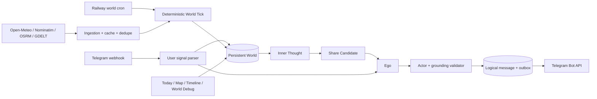

# Mira

Mira 是一个 Telegram-native AI companion，也是一个持续推进的北京生活世界。她有持久化的住所、工作、日程、地点、配角、未完成事项、情绪原因和分享动机；用户不发消息时，Railway World Tick 仍会按北京时间推进她的生活。

这不是新闻播报 bot，也不是只跟随当前输入的角色扮演 prompt。Psyche 的 Id / Ego / Actor、人格、记忆、关系、情绪和成长继续存在；World Engine 独占物理世界事实的确认权限，Actor 只负责表达已落库的事实。

## Architecture



核心不变量：

- 数据库时间保存 UTC，日历、quiet hours 和日程使用 `Asia/Shanghai`。
- 15 分钟 tick 以 `(companionId, windowStart)` 唯一，seed 由 SHA-256 派生，可重放。
- 外部请求不放在数据库事务里；provider 失败不能阻断普通世界推进。
- 物理到访必须通过日程、地点、路线、开放时间、天气和非瞬移校验。
- 主动消息必须来自持久化的事件、想法、open loop 或用户 follow-up。
- 逻辑消息和 bubble outbox 先事务落库，再发 Telegram；网络结果未知时停止自动重试。
- 所有关键状态变化带 `correlationId`，可在 World Debug 中沿因果链追踪。

详细表结构、状态所有权和回滚策略见 [docs/architecture.md](docs/architecture.md)。

## Main directories

- `app/`：Next.js App Router、Dashboard 和 HTTP Route Handlers。
- `core/`：消息 runtime、Actor context、prompt budget、metrics 和 audit。
- `psyche/`：Analyzer、Id、Ego、Actor、Memory、Growth、Novelty。
- `world/`：日程、tick reducer、事件、地点、分享、回复期待、grounding 和 providers。
- `db/`：Drizzle schema 和按领域拆分的 repositories。
- `messaging/`：transactional outbox drain。
- `telegram/`：Webhook 验证、bubble 拆分和 Telegram transport。
- `drizzle/`：additive migrations；`drizzle/down/` 是测试库回滚 SQL。
- `scripts/`：seed、webhook、cron 和固定验收 demo。

## Requirements

- Bun 1.3+
- Node.js 20.9+
- Neon Postgres 或 Railway Postgres，并启用 pgvector
- Telegram bot
- OpenRouter API key
- Railway project

## Environment variables

复制 `.env.example` 为 `.env`：

| Variable | Required | Purpose |
| --- | --- | --- |
| `DATABASE_URL` | yes | Postgres TCP connection string |
| `API_KEY` | yes | OpenRouter API key |
| `BASE_URL` | no | 默认 `https://openrouter.ai/api/v1` |
| `MODEL` | no | Actor / Analyzer / reflection 模型 |
| `OPENROUTER_WEB_SEARCH_ENABLED` | no | 默认 `false`；开启后 OpenRouter web search 可能单独计费 |
| `TELEGRAM_BOT_TOKEN` | yes | Telegram Bot API |
| `TELEGRAM_ALLOWED_USER_ID` | yes | 允许使用 bot 的唯一用户 |
| `TELEGRAM_WEBHOOK_SECRET` | yes | Webhook secret-token 校验 |
| `CRON_SECRET` | yes | HTTP cron route 保护 |
| `ADMIN_PASSWORD` | yes | Dashboard httpOnly cookie 登录 |
| `EXTERNAL_INGESTION_ENABLED` | no | 公共天气、地图和新闻 ingestion 的运维开关，默认关闭；生产显式设为 `true` |
| `TEST_DATABASE_URL` | tests | 仅允许数据库名为 `mira_test` |

不要给任何密钥添加 `NEXT_PUBLIC_` 前缀。公共地图 provider 不需要 key。

## Local development

```bash
bun install --frozen-lockfile
bun run db:migrate
bun run seed
bun run dev
```

打开 `http://localhost:3000/login`，使用 `ADMIN_PASSWORD` 登录。

质量门：

```bash
bun run typecheck
bun run lint
bun run test:unit
bun run test:integration
bun run build
bunx drizzle-kit check
git diff --check
```

集成测试必须使用独立数据库：

```bash
TEST_DATABASE_URL='postgresql://.../mira_test' bun run test:integration
```

测试会拒绝任何不叫 `mira_test` 的数据库。

## Database setup and migrations

1. 创建 Postgres database。
2. 确保用户可以执行 `CREATE EXTENSION IF NOT EXISTS vector`。
3. 配置 `DATABASE_URL`。
4. 执行：

```bash
bun run db:migrate
bun run seed
```

生产环境只追加 migration，不修改已经发布的 SQL。`bun run db:push` 仅用于本地探索。回滚时先暂停四类 cron、排空或检查 outbox、回退应用；`drizzle/down/` 只在 `mira_test` 验证，不建议生产直接删表。

## Telegram setup

1. 在 `@BotFather` 创建 bot。
2. 给 bot 发私聊并取得自己的数字 user id。
3. 配置 token、allowed user id 和 webhook secret。
4. Web 服务上线后注册 webhook：

```bash
bun run telegram:set-webhook -- https://YOUR_DOMAIN
```

注册路径固定为 `/api/telegram/webhook`。验证：

```bash
curl "https://api.telegram.org/bot$TELEGRAM_BOT_TOKEN/getWebhookInfo"
```

Mira 只接受允许用户的私聊。Webhook 重试由 incoming message 幂等键和 processing lease 吸收。

## Railway deployment

Web service：

```bash
railway login
railway link
railway up --detach --message "Deploy Mira"
railway domain
railway run bun run db:migrate
railway run bun run seed
```

`BASE_URL` 是 OpenRouter 地址，不是 Railway domain。健康检查为 `/api/health`。

Railway cron 使用 UTC。免费计划下使用三个独立 service，共享同一组数据库、Telegram、OpenRouter 和 provider 变量：

| Service | UTC schedule | Beijing meaning | Start command |
| --- | --- | --- | --- |
| `mira-world` | `*/15 * * * *` | 每 15 分钟 | `bun run cron:world` |
| `mira-outbox` | `*/5 * * * *` | 每 5 分钟补发可安全重试项 | `bun run cron:outbox` |
| `mira-hourly` | `50 * * * *` | 每小时消费 share candidates；UTC 15:50 同进程追加 daily reflection | `bun run cron:hourly-daily` |

Cron 进程直接调用 runtime 并在完成后退出。HTTP route 也可手动验收，但必须带 `CRON_SECRET`：

三个 worker 分别使用 `railway.world.json`、`railway.outbox.json` 和 `railway.hourly.json`。在 Railway service 的 Config File Path 中绑定对应文件；不要用 Web 的通用 `railway.json` 覆盖 worker，否则它们会退回长驻 `bun run start`。

```bash
curl -H "Authorization: Bearer $CRON_SECRET" https://YOUR_DOMAIN/api/cron/world
curl -H "Authorization: Bearer $CRON_SECRET" https://YOUR_DOMAIN/api/cron/outbox
curl -H "Authorization: Bearer $CRON_SECRET" https://YOUR_DOMAIN/api/cron/hourly
curl -H "Authorization: Bearer $CRON_SECRET" https://YOUR_DOMAIN/api/cron/daily
```

这些 route 会写数据库，hourly/outbox 还可能真的发送 Telegram；不要在生产重复点。

## Beijing providers

- Open-Meteo：无 key 北京实时天气，缓存 30 分钟并保留 attribution；雨雪风险只影响 12 小时内的日程。
- OpenStreetMap Nominatim：按需搜索地点，不导入全北京 POI；最多保留 20 个候选，缓存 7 天并幂等写入 `KnownPlace`。
- OSRM：公共步行/骑行路线，缓存 30 分钟；不提供公交路线。
- GDELT：北京、本地生活、科技和游戏新闻候选，缓存 2 小时。
- OpenRouter `nvidia/llama-nemotron-embed-vl-1b-v2:free`：请求 1024 维输出，用于外部信息去重。

新闻只保存 URL、标题、短摘要和结构化事实，不保存全文。Provider 通过 timeout、一次 429/5xx retry、TTL cache 和 `Promise.allSettled` 隔离故障。
可靠、新颖且符合 Mira 兴趣的社会热点会先生成可审计的 `InnerThought`，每轮最多两条；它们的分享优先级低于真实生活事件，不会直接变成新闻播报。

## Dashboard

- Overview：消息、主动预算、工具、记忆、人格状态和最近事件。
- Today：北京时间、当前位置、当前活动、今日完成项和有原因的计划变化。
- Map：OpenStreetMap 公共底图、去过/想去/用户推荐/共同记忆地点。
- Timeline：重要世界事件、地点、角色、用户影响和后续。
- World Debug：WorldState、Schedule、Characters、OpenLoops、SharedKnowledge、InnerThoughts、ShareCandidates、AwaitingReply、ExternalInformation、Tick Log、Prompt Context 和 LLM usage。
- Conversations / State / Psyche / Memory / Events / Proactive / Tools / Audit / Settings：保留原人格 runtime 的可观测性和配置能力。

`/dashboard/world` 仍表示 Inner World；北京持久世界使用 Today、Map、Timeline 和 World Debug。

## Runtime verification

固定、无外部密钥的验收：

```bash
bun run demo:world
bun run simulate:world
```

它使用固定周五北京时间和 seed，验证：工作日计划、降雨改去室内地点、普通事件、InnerThought、ShareCandidate、fake Telegram、用户地点推荐，以及重要问题未回复后的有限 disappointment 和渐进恢复。

`simulate:world` 额外重放 14 天 / 1344 个 tick，输出日程一致性、每天普通事件密度、分享候选可达性、情绪范围和 replay digest；同一 seed 的结果必须完全一致。

手动 runtime：

```bash
bun run cron:world
bun run cron:outbox
bun run cron:hourly
bun run cron:daily
```

## API routes

- `POST /api/telegram/webhook`
- `GET /api/cron/world`
- `GET /api/cron/outbox`
- `GET /api/cron/hourly`
- `GET /api/cron/daily`
- `POST /api/admin/login`
- `GET /api/admin/state|messages|memories|events|settings`
- `GET /api/admin/world/trace`
- `POST /api/admin/world/generate`

## Design notes

- 角色 profile 在 `companions.configJson`，北京默认设定不写进业务条件分支。
- 配角是持久化的虚构人物；系统不模拟完整多 Agent 社会。
- 日程以代码模板生成，接近 60% 稳定习惯、25% 事件调整、15% seeded 变化；普通 tick 不调用 LLM。
- Actor context 默认约 6000 estimated tokens，身份、当前状态和当前消息不会被裁剪；当前消息只出现一次。
- Actor 可在 Ego 明确允许时使用 [OpenRouter web search](https://openrouter.ai/docs/guides/features/server-tools/web-search)，但外部事实必须带来源，个人经历仍不能从网络生成。
- Telegram API 没有服务端幂等键。请求超时会标记 `delivery_unknown` 并停止自动重发，以避免重复轰炸；这比伪装 exactly-once 更诚实。

## Next steps

- 定期跑 Open-Meteo、Nominatim、OSRM 和 GDELT contract smoke test，并监控公共服务限流。
- 将用户推荐地点的自主采纳策略从规则扩展为可审计的 planner proposal。
- 给新闻实体去重补充批量 embedding 队列，避免 ingestion 峰值。
- 增加 provider 预算报警，并为 GDELT 超时率设置观测阈值。
